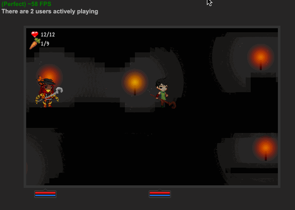

# Legend Bit

[](https://github.com/tylerdiaz/legend-of-16bit/blob/master/demo.gif)

Legend bit is a dungeon crawler style game engine I was experimenting with early 2011.

The game is delibirately designed without many dependencies. On the front end it only uses requireJS, jQuery, and "buzz" for sound effects. Physics/Collision management, canvas rendering, unit management, and map rendering are done with plain Javascript. The map is generated from a [bitmap file](https://github.com/tylerdiaz/legend-of-16bit/blob/master/public/maps/map1.png) which is [iterated pixel-by-pixel](https://github.com/tylerdiaz/legend-of-16bit/blob/master/mob.js#L265) to determine what features the map should have like torches, carrots, ladders, and monsters.

The game has realtime multiplayer and a simple combat system with HP and energy.

## Getting it to run

```
git clone https://github.com/tylerdiaz/legend-of-16bit
cd legend-of-16bit
npm i
npm start
open http://localhost:3000/
```
